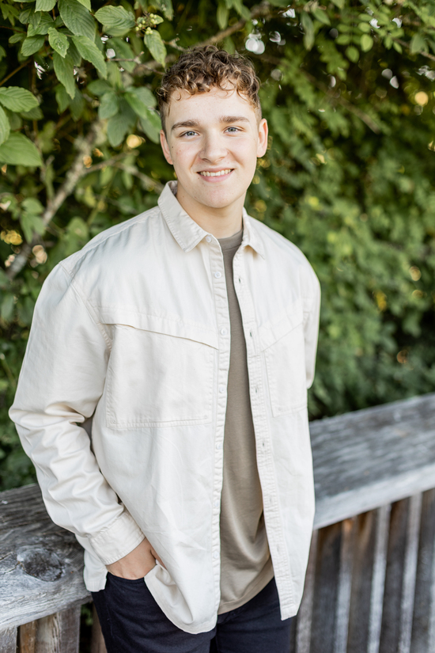

 
  <a href="ntebbs@arizona.edu" target="_blank">ntebbs@arizona.edu</a>   
  <a href="tel:+3605228450" target="_blank">(360) 522-8450</a>  
  <a href="https://www.github.com/nathantebbs" target="_blank">GitHub</a>  
  <a href="https://www.linkedin.com/in/ntebbs" target="_blank">LinkedIn</a>  

## Languages
- HTML, CSS, Javascript
- C
- Java

## Education
I am currently a Computer Science student attending the University of Arizona. Before arriving in Tucson, I earned my Associate in Arts at South Puget Sound Community College during my last two years of high school. This allowed me to get ahead in my degree coursework, enabling me to graduate in the fall of 2025.

As of spring semester 2025 I am officially one of the UGTAs for [CSc 346](https://dev.ericnewberry.com/csc346/) at the University of Arizona!

### Coursework

#### Fall 2023

- CSC 144 - Discrete Mathematics I
- CSC 210 - Software Development

#### Spring 2024

- CSC 244 - Discrete Mathematics II
- CSC 346 - Cloud Computing

#### Summer 2024

- CSC 252 - Computer Organization

#### Fall 2024

- CSC 337 - Software Engineering and Development
- CSC 352 - Systems Programming & UNIX
- CSC 345 - Analysis of Discrete Structures

#### Spring 2025

- CSC 380 - Principles of Data Science
- CSC 391 - Preceptorship

